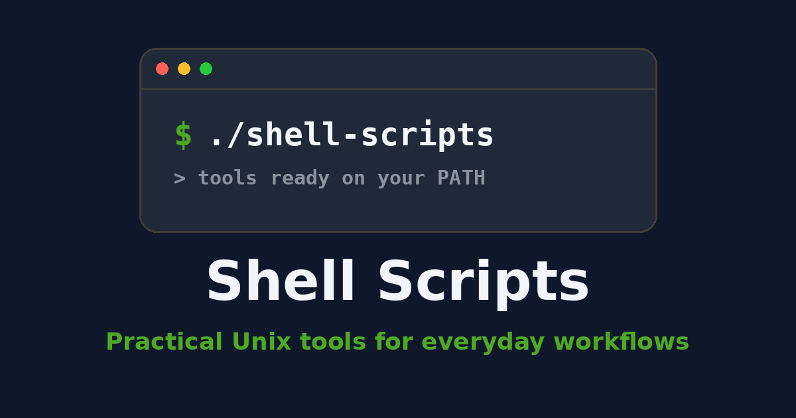

# Shell Scripts

[](https://github.com/zlatanstajic/shell-scripts/actions/workflows/ci.yml)
[](LICENSE.md)
[](https://zlatanstajic.github.io/shell-scripts/)
[](https://www.gnu.org/software/bash/)
[](https://www.shellcheck.net/)

> Custom Unix shell scripts for git development setup, PHP version switching, password generation, machine backups, decrypting the `.env` files a backup encrypted, restoring a project's `.vscode` folder, hashing filenames, copying a git diff between commits, splicing images and videos, installing Tampermonkey userscripts from a GitHub repository, gating shell-initiated shutdowns/restarts behind configurable guards, and listing every custom command you have — from this repository and from the sibling `python_scripts` repository — with a marker showing whether it currently resolves on `PATH`.

📖 **Browse the docs:** [zlatanstajic.github.io/shell-scripts](https://zlatanstajic.github.io/shell-scripts/) (source in [`docs/`](docs/), published via GitHub Pages).



## Table of Contents

- [Install](#install)
- [List of Available Scripts](#list-of-available-scripts)
- [Testing](#testing)
- [Continuous Integration](#continuous-integration)
- [Releases](#releases)
- [Security](#security)
- [Contributing](#contributing)
- [License](#license)

---

## Install

Make every script a first-class command on your `PATH` with one command. From the repository root:

```bash
bash install.sh
```

This symlinks each script in `src/scripts/` into `~/.local/bin` under its bare name (the `.sh` is stripped), so `generate-password -l 20`, `dev-setup -nu 1 -na "..."`, `backup`, and the rest run directly. The maintainer-only `gen-docs.sh` is intentionally not installed.

- **Custom location:** `bash install.sh --prefix ~/bin` installs into `~/bin` instead.
- **Idempotent:** re-running is safe — existing links are re-pointed (handy if you move the clone) and unrelated files in the prefix are never clobbered.
- **PATH warning:** if the prefix is not on your `PATH`, the installer prints (but does not fail on) the exact `export PATH="..."` line to add to your shell rc.
- **Completion:** a bash completion file for the command names is installed into your user bash-completion directory when bash completion is available; otherwise the installer prints a `source` line you can add to `~/.bashrc`.

The symlinks resolve back into the clone (`readlink -f` dereferences them), so the clone must stay where it is, and `src/lib/` must remain beside `src/scripts/`. If you move the clone, re-run `bash install.sh` to re-point the links.

Remove the installed commands at any time:

```bash
bash uninstall.sh            # or: bash uninstall.sh --prefix ~/bin
```

`uninstall.sh` removes only the symlinks that point into this repo's `src/scripts/`, leaving any other files in the prefix untouched.

[⬆ back to top](#table-of-contents)

---

## List of Available Scripts

This is a list of available scripts you may use on any Unix-like system.

<!-- BEGIN GENERATED: command-reference -->

<details markdown="1">
<summary><strong>Backup</strong> — <code>src/scripts/backup.sh</code></summary>

```text
Running backup.sh
Description: Backup documents on Linux machine

Show this help  : backup.sh -h
Run this script : backup.sh
Preview only    : backup.sh -n

  -h, --help     Show this help and exit
  -n, --dry-run  Print intended changes; make no filesystem change
  -y, --yes      Skip the confirmation prompt before mutating

Configuration is read from <repo-root>/.env (see .env.example).
BACKUP_LOCATION is required; per-section variables are optional.
```

</details>

<details markdown="1">
<summary><strong>Decrypt Env Files</strong> — <code>src/scripts/decrypt-env-files.sh</code></summary>

```text
Running decrypt-env-files.sh
Description: Decrypt backed-up project env files (.env.enc/.env.rb.enc)

Show this help  : decrypt-env-files.sh -h
Run this script : decrypt-env-files.sh
Preview only    : decrypt-env-files.sh -n
Clean only      : decrypt-env-files.sh -c

  -h, --help     Show this help and exit
  -c, --clean    Remove the .decrypted plaintext files (no decryption)
  -n, --dry-run  Print intended changes; make no filesystem change
  -y, --yes      Skip the confirmation prompt before mutating

Configuration is read from <repo-root>/.env (see .env.example).
BACKUP_LOCATION, PROJECTS_DESTINATION_FOLDER_NAME and
ENV_FILES_PASSWORD are all required.
With --clean only BACKUP_LOCATION and
PROJECTS_DESTINATION_FOLDER_NAME are needed (neither
ENV_FILES_PASSWORD nor openssl is required).
```

</details>

<details markdown="1">
<summary><strong>Dev Setup</strong> — <code>src/scripts/dev-setup.sh</code></summary>

```text
Running dev-setup.sh
Description: Development setup for git

Show this help  : dev-setup.sh -h
Run this script : dev-setup.sh -nu 1 -na "Example issue name"

  -nu, --number   Issue number (required)
  -na, --name     Issue name (required)
```

</details>

<details markdown="1">
<summary><strong>Generate Password</strong> — <code>src/scripts/generate-password.sh</code></summary>

```text
Running generate-password.sh
Description: Generate strong and secure password
Minimum length is 8 and must be divisible by 4.

Show this help    : generate-password.sh -h
Generate password : generate-password.sh -l 20
```

</details>

<details markdown="1">
<summary><strong>Git Copy</strong> — <code>src/scripts/git-copy.sh</code></summary>

```text
Running git-copy.sh
Description: Copy all differences between two git commits

Show this help  : git-copy.sh -h
Run this script : git-copy.sh

  -s, --start_commit_hash      Start commit hash (optional)
  -e, --end_commit_hash        End commit hash (optional)
  -t, --target_directory_path  Target directory path (optional)

Defaults are computed at runtime: start is the penultimate commit,
end is the last commit. When -t is omitted the target defaults to
$GIT_COPY_TARGET_DIRECTORY_PATH/<repo-basename> (see .env.example);
when -t is given its value is used verbatim.
```

</details>

<details markdown="1">
<summary><strong>Hash Filenames</strong> — <code>src/scripts/hash-filenames.sh</code></summary>

```text
Running hash-filenames.sh
Description: Renames files in a directory to random hash names

Show this help   : hash-filenames.sh -h
Hash a directory : hash-filenames.sh -d /path/to/dir
Verbose output   : hash-filenames.sh -d /path/to/dir -v
Move into batches: hash-filenames.sh -d /path/to/dir -m
Preview only     : hash-filenames.sh -d /path/to/dir -n

  -h, --help       Show this help and exit
  -d, --directory  Directory to process (defaults to current directory)
  -v, --verbose    Enable verbose output
  -m, --move       Move hashed files into hashed_00X folders
  -n, --dry-run    Print intended changes; make no filesystem change
  -y, --yes        Skip the confirmation prompt before mutating

Target extensions are read from HASH_FILENAMES_FILE_EXTENSIONS in
<repo-root>/.env (see .env.example).
```

</details>

<details markdown="1">
<summary><strong>My Scripts</strong> — <code>src/scripts/my-scripts.sh</code></summary>

```text
Running my-scripts.sh
Description: List the custom commands provided by the shell-scripts
and python_scripts repositories, each with a one-line description and
whether it currently resolves on PATH.

Show this help  : my-scripts.sh -h
Run this script : my-scripts.sh

  -f, --filter  Only list commands whose NAME contains this text
                (case-insensitive substring match, optional)
  -h, --help    Show this help

The shell-scripts location is derived from this script's own path and
is never configurable. The python_scripts location comes from the
EXPORTED environment variable MY_SCRIPTS_PYTHON_REPO_PATH (default:
$HOME/repos/python_scripts). It is NOT a .env key - this script never
reads .env, so setting it there has no effect. When that repository is
missing, its section is skipped with a warning.

python_scripts commands are console entry points installed inside that
repository's virtualenv, so they read as [not on PATH] unless the
virtualenv is active. Shell commands read as [not on PATH] until
install.sh has linked them onto PATH.
```

</details>

<details markdown="1">
<summary><strong>PHP Switch</strong> — <code>src/scripts/php-switch.sh</code></summary>

```text
Running php-switch.sh
Description: Switch main version of PHP on OS

Show this help : php-switch.sh -h
Switch version : php-switch.sh -v 8.1
Interactive    : php-switch.sh
```

</details>

<details markdown="1">
<summary><strong>Restore VSCode Folder</strong> — <code>src/scripts/restore-vscode-folder.sh</code></summary>

```text
Running restore-vscode-folder.sh
Description: Restore the .vscode folder from backup into the current
directory (only when it has no .vscode yet).

Show this help  : restore-vscode-folder.sh -h
Run this script : restore-vscode-folder.sh

Configuration is read from <repo-root>/.env (see .env.example).
Reuses BACKUP_LOCATION and PROJECTS_DESTINATION_FOLDER_NAME; both are
required. Restores from <BACKUP_LOCATION>/
<PROJECTS_DESTINATION_FOLDER_NAME>/<current-dir-basename>/.vscode.
```

</details>

<details markdown="1">
<summary><strong>Shutdown Guard</strong> — <code>src/scripts/shutdown-guard.sh</code></summary>

```text
Running shutdown-guard.sh
Description: Gate a shell-initiated shutdown/restart behind .env guards

Show this help  : shutdown-guard.sh -h
Run this script : shutdown-guard.sh -s
Preview only    : shutdown-guard.sh -n -s

  -s, --shutdown  Power off when every guard passes
  -r, --restart   Reboot when every guard passes
  -n, --dry-run   Run the guards; print the power command, never run it
  -y, --yes       Skip the confirmation prompt before powering off
  -f, --force     Bypass ALL guards (use with care)
  -h, --help      Show this help and exit

Exactly one of -s/--shutdown or -r/--restart is required.

Configuration is read from <repo-root>/.env (see .env.example):
SHUTDOWN_GUARD_<i>_CMD / _DESC / _MODE declare the guards (scanned from
1 until the first missing _CMD); modes are status, empty, match:<ERE>
and nomatch:<ERE>. SHUTDOWN_GUARD_TIMEOUT (default 10 seconds, fail
closed) and SHUTDOWN_GUARD_STRICT (default 0) tune the evaluation.

Exit codes: 0 proceeded, 1 usage/configuration error, 3 BLOCKED by a
guard (nothing was shut down).

This gates only shutdowns routed through this script. It cannot stop
the desktop power menu, the power button, sudo poweroff, --force,
or remote/cron-triggered shutdowns.
```

</details>

<details markdown="1">
<summary><strong>Splice Images</strong> — <code>src/scripts/splice-images.sh</code></summary>

```text
Running splice-images.sh
Description: Splices images horizontally using ffmpeg

Show this help    : splice-images.sh -h
Splice given imgs : splice-images.sh -i a.jpg b.jpg
Splice 3 images   : splice-images.sh -i a.jpg b.jpg c.jpg -n 3
Random 2 from cwd : splice-images.sh
Fixed scale height: splice-images.sh -i a.jpg b.jpg --height 200

  -h, --help     Show this help and exit
  -i, --images   One or more input image files
  -o, --output   Output filename (only its extension is used)
      --height   Target scale height (default: auto from first image)
  -n, --number   Number of images to splice (default: 2)
      --dry-run  Print intended changes; make no filesystem change
                 (long form only; -n stays bound to --number)

Valid extensions are read from SPLICE_IMAGES_FILE_EXTENSIONS in
<repo-root>/.env (see .env.example).
```

</details>

<details markdown="1">
<summary><strong>Splice Videos</strong> — <code>src/scripts/splice-videos.sh</code></summary>

```text
Running splice-videos.sh
Description: Splices random clips of a video into one output video

Show this help    : splice-videos.sh -h
Splice 12s output : splice-videos.sh -i clip.mp4 -d 12
Custom segment    : splice-videos.sh -i clip.mp4 -d 12 -s 4
Preview only      : splice-videos.sh -i clip.mp4 -d 12 -n

  -h, --help       Show this help and exit
  -i, --input      Input video file (Required)
  -d, --duration   Output video duration in seconds (Required)
  -s, --segment    Random clip duration in seconds (default: 3)
  -n, --dry-run    Print intended changes; make no filesystem change
  -y, --yes        Skip the confirmation prompt before mutating

Valid extensions are read from SPLICE_VIDEOS_FILE_EXTENSIONS in
<repo-root>/.env (see .env.example).
```

</details>

<details markdown="1">
<summary><strong>Tampermonkey Install</strong> — <code>src/scripts/tampermonkey-install.sh</code></summary>

```text
Running tampermonkey-install.sh
Description: Build a GitHub userscript URL and open it for Tampermonkey

Show this help  : tampermonkey-install.sh -h
Run this script : tampermonkey-install.sh -d <domain> -s <script>

  -d, --domain   Domain-name folder (required, e.g. youtube.com)
  -s, --script   Script name, no extension (required, e.g. video-speed)
  -r, --repo     Override the configured GitHub base URL (optional)
  -h, --help     Show this help and exit

Base URL(s) read from TAMPERMONKEY_REPO_BASE_URLS in
<repo-root>/.env (see .env.example). A comma-separated list is
probed with curl (redirects followed); the first URL answering
HTTP 2xx is opened, else the first entry. Private GitHub repos
need GH_TOKEN/GITHUB_TOKEN or 'gh' for the probe to see them.
```

</details>
<!-- END GENERATED: command-reference -->

[⬆ back to top](#table-of-contents)

---

## Testing

The repository ships a zero-dependency, pure-bash test harness under [`tests/`](tests/) — no `bats`, `shunit2`, or any other framework required.

```bash
# Run the whole suite
bash tests/run.sh

# Run a single test file
bash tests/run.sh tests/test_common.sh
```

Layout: shared-library tests live at the `tests/` root; per-script tests live under [`tests/scripts/`](tests/scripts/). The runner discovers every `test_*.sh` under `tests/` recursively.

The runner prints a ✓/✗ line per assertion and exits non-zero if any assertion fails, so it doubles as a CI gate.

- [`tests/run.sh`](tests/run.sh) — discovers and sources every `tests/test_*.sh` file, then prints a summary.
- [`tests/lib/assert.sh`](tests/lib/assert.sh) — assertion helpers (`assert_eq`, `assert_contains`, `assert_match`, `assert_exit`) and the shared `TESTS_RUN`/`TESTS_FAILED` counters plus a resolved `REPO_ROOT`.
- [`tests/test_common.sh`](tests/test_common.sh) — unit tests for the shared library [`src/lib/common.sh`](src/lib/common.sh) (`UrlEncode`, the `Log*`/`EchoBold` helpers, and `End`/`MissingRequiredArguments` exit codes, the last run in subshells because they call `exit`).
- [`tests/test_install.sh`](tests/test_install.sh) — tests for [`install.sh`](install.sh) and [`uninstall.sh`](uninstall.sh), including the assertion that the user-facing command set and [`src/completion/shell-scripts.bash`](src/completion/shell-scripts.bash) stay in step.
- [`tests/scripts/`](tests/scripts/) — behavioural tests that drive one script each as a subprocess. Covered today: `backup`, `decrypt-env-files`, `gen-docs`, `generate-password`, `hash-filenames`, `my-scripts`, `shutdown-guard`, `splice-images`, `splice-videos`, `tampermonkey-install`. Not yet covered: `dev-setup`, `git-copy`, `php-switch`, `restore-vscode-folder`.

To add tests for another script, drop a `tests/scripts/test_<name>.sh` file: use `$REPO_ROOT` for paths, run `exit`-calling code through `assert_exit` in a subshell, and assert whole-script behaviour by running it with `bash "$SCRIPT"` and checking the exit code plus the captured `$ASSERT_OUTPUT`. Capture script output via a temp file rather than a pipe — `generate-password.sh` can leave a `tr < /dev/urandom` reader holding a pipe open, which hangs `| sed` / `$()` readers on EOF.

[⬆ back to top](#table-of-contents)

---

## Continuous Integration

Every push to `master` and every pull request runs three jobs via GitHub Actions — see [`.github/workflows/ci.yml`](.github/workflows/ci.yml). **All three are hard gates**; a failure in any of them fails the build.

| Job | Command | Checks |
|-----|---------|--------|
| Test suite | `bash tests/run.sh` | Every assertion in the pure-bash harness. |
| Docs reference | `bash src/scripts/gen-docs.sh --check` | The generated flags/usage reference is in sync with each script's `-h`. |
| ShellCheck | `shellcheck src/scripts/*.sh src/lib/common.sh install.sh uninstall.sh` | Lint across every script, the shared library, and both installers. |

The `shellcheck` version is pinned in the workflow (and its download checksum verified), so a refreshed runner image cannot introduce new findings and break `master` without a change in this repository. The workflow declares `permissions: contents: read` — no job publishes, pushes, or reads a secret — and uses a concurrency group so a superseded run for the same ref is cancelled.

### Pre-commit hook

Run the same three checks locally before each commit using a native git hook (no `husky`, `npm`, or other dependency). The hook lives in the repository at [`.githooks/pre-commit`](.githooks/pre-commit), so failures surface before you push.

**Enforcement differs from CI on purpose.** In CI all three checks are hard gates. In the hook only the test suite blocks a commit; the docs-reference check and `shellcheck` print a warning and let the commit through. A local hook must not block you because of your own `.env` (`gen-docs.sh` runs every script's `-h`, which sources it) or because `shellcheck` is missing or a different version. CI is the enforcement boundary; the hook is the fast heads-up.

Git does not enable repository hooks automatically on clone, so enable them once per clone by pointing git at the versioned hooks directory:

```bash
git config core.hooksPath .githooks
```

From then on the hook runs automatically on every `git commit`. A failing test aborts the commit; a missing `shellcheck` is skipped. Bypass the hook for a single commit with:

```bash
git commit --no-verify
```

[⬆ back to top](#table-of-contents)

---

## Releases

Release history lives on the [GitHub releases page](https://github.com/zlatanstajic/shell-scripts/releases), which is the canonical changelog for this project — there is deliberately no `CHANGELOG.md` to keep in sync with it. Each release is tagged `MAJOR.MINOR.PATCH`; a new major marks a script being added, removed, or changed in a way that breaks an existing invocation.

[⬆ back to top](#table-of-contents)

---

## Security

Found a vulnerability? **Do not open a public issue.** See [SECURITY.md](SECURITY.md) for the private reporting process, what to include, and what is in and out of scope.

Two things worth knowing before you run anything:

- **Your `.env` is sourced as shell, not parsed.** Any shell in it executes — including on a `-h` run, because the `source` happens before argument parsing. Treat it as executable code you own.
- **`shutdown-guard.sh` only gates shutdowns routed through itself.** The desktop power menu, the power button, `sudo poweroff`, and remote or cron shutdowns all bypass it by design.

[⬆ back to top](#table-of-contents)

---

## Contributing

Contributions are welcome. See [CONTRIBUTING.md](CONTRIBUTING.md) for how to propose a change, and [CODE_OF_CONDUCT.md](CODE_OF_CONDUCT.md) for the standards expected of everyone taking part.

[⬆ back to top](#table-of-contents)

---

## License

This project is licensed under the MIT License. See the [LICENSE](LICENSE.md) file for details.

[⬆ back to top](#table-of-contents)
